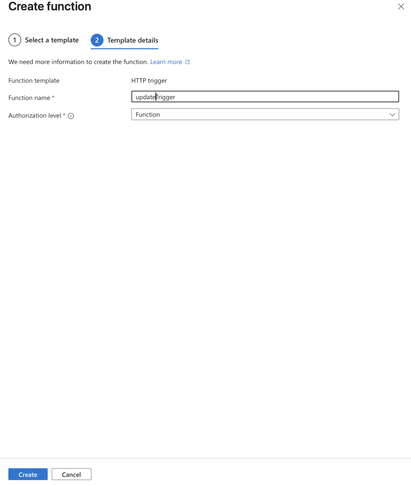

# CST8911 Midterm Project

## Scenario 1

## Screenshots

## Creating a Function App

## Creating Get, Post, Delete and Update httptriggers

## Added env. variable to connected CosmoDB to the HttpTrigger

### getTrigger

### postTrigger

### updateTrigger

### Adding the cosmoDB connection string

### Where the cosmoDB Connection String is located

## Creating a Javascript function that fetches all data from the database

## Connecting the Trigger by adding function context into the function.json to fetch the database

## Creating a Javascript function that creates a new product in the database

## Connecting the Trigger by adding function context into the function.json to post data the database

