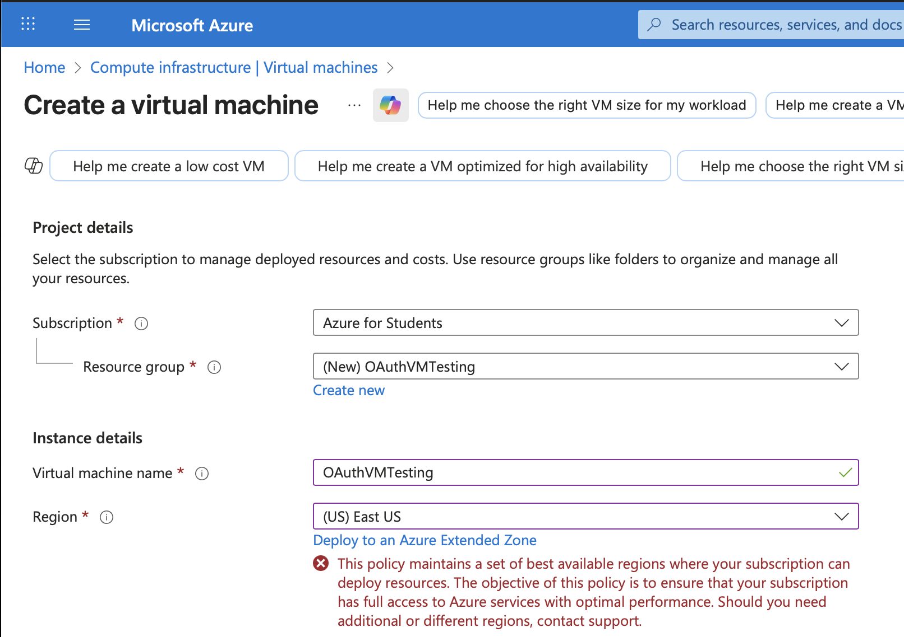

# CST8911 Midterm Project

## Group 2 members - Desmond Murphy, Dharti Patel, Fayz Reshid, Kylath Mamman George, Olivie Bergeron

## Chosen scenario - scenario 1

## Auth-Server documentation and source code

[Auth-Server Source Code](https://github.com/OlivBerg/auth-server),
[Auth-Server Documentation](https://github.com/OlivBerg/auth-server/blob/main/readme.md)

---

## Creating a Function App

- Created an Azure Function App named restful-function using the Node.js 22 LTS runtime stack.

## Creating GET and POST HTTP trigger functions

- Added HTTP trigger functions to handle GET and POST requests for the REST API.
This lets the Function App respond to incoming requests without needing a full server.

### getTrigger

- Created a new HTTP trigger function named getTrigger. This function allows users to send a GET request and receive data from the database.The authorization is kept at Function app for basic authentication while testing.

### postTrigger

- Created another HTTP tirgger functions named postTrigger. This function handles POST requests to add new data to the database. Used the same Function authorization level for consistency with the GET trigger.

### Adding the cosmoDB primary connection string

- Added the Cosmos DB connection string to the Function App’s environment variables.
This allows the Function App to securely connect to the database without exposing credentials in code.

### Where the cosmoDB primary connection String is located

- Found the Cosmos DB primary connection string under the Keys section in the Azure Portal.
Copied this value into the Function App’s configuration settings to complete the database connection setup.

## Creating a Javascript function that fetches all data from the database

- Wrote a JavaScript (Node.js) function that connects to the Cosmos DB and fetches all records from the database.
The function runs inside Azure Functions and returns JSON data when a GET request is made.
Tested the function directly in the Azure portal and confirmed it returns data successfully

## Connecting the Trigger by adding function context into the function.json to fetch the database

- Linked the HTTP trigger to the function by updating the function.json file.
This ensures that the GET trigger runs the correct JavaScript function whenever a request is made.
Helps connect the backend logic with the database so the data can be fetched properly.

## Creating a Javascript function that creates a new product in the database

- Wrote a JavaScript (Node.js) function called postTrigger that creates a new product entry in the Cosmos DB.
The function checks if the request body includes valid data before saving it to the database.
This allows new records to be added securely using a POST request

## Connecting the Trigger by adding function context into the function.json to post data the database

- Updated the function.json file to connect the HTTP triggers with the Cosmos DB input and output bindings.
The bindings link the getTrigger and postTrigger functions to the same database container for reading and writing data.
This setup lets both functions share the same connection and operate on the same dataset.

## Created App Service Web app for the Auth Server

- We originally thought of using the built in Entra ID with azure, but due to the policy on our education accounts we do not have access to Entra, next we looked into setting up a full oauth server within a vm but were not able to make it function properly. Finally, due to some javascript experience within our team we decided to set up JWT tokens to authenticate requests.

- We decided to deploy the authentication server on app services instead of a full VM because it is more cost efficient and we don't need to worry about configuring a whole VM environment just to run the authentication server.

- Deployed an App Service Web App to host the authentication server.
Used the Canada Central region and linked it to the project’s GitHub repo for automatic updates

### In the Web app we connected our github account to setup a CI/CD pipeline for our Auth Server

- Connected the Web App to the GitHub repository (OlivBerg/auth-server) for continuous integration and deployment.
Every push to the main branch automatically triggers a deployment using GitHub Actions.
The app runs on Node.js 22 LTS for compatibility with the Function App backend.

### Environment variables for the Auth server

Added environment variables such as AZURE_GET_URL, AZURE_POST_URL, JWT_SECRET, and PORT.
These variables help the Auth Server securely connect with Azure Functions and generate authentication tokens.

## VM Region Policy Error

- Created a low-cost Azure VM using the B2s size to keep costs down while still meeting project needs, we originally tried creating a VM with the B1 size but faced issues when trying to use SSH to access VM.

- Faced a policy restriction when trying to deploy in the US East region, so we switched to Canada Central for compatibility with the Azure for Students subscription.

## Creating a VM to test our Authentication

- Set up a Linux (Ubuntu) VM to test the authentication process independently.
The VM is hosted in the West US 2 region using the Azure for Students subscription.

## Creating a session with the Auth server hosted through a VM

- After accessing the VM through an SSH connection we used curl commands on the VM to send login requests to the Auth Server. We were then able to confirm a successful login response containing a valid JWT token for the admin user.

## Sending a POST request to add a product to our db

- Sent a POST request using curl to add new products to the Cosmos DB through the Auth Server’s /post route.
The response confirmed that data was added successfully to the database.

## Retrieving products from our DB

- Sent a GET request using curl to fetch all products from the database.
The API returned all stored records, showing that both authentication and data retrieval worked correctly.
