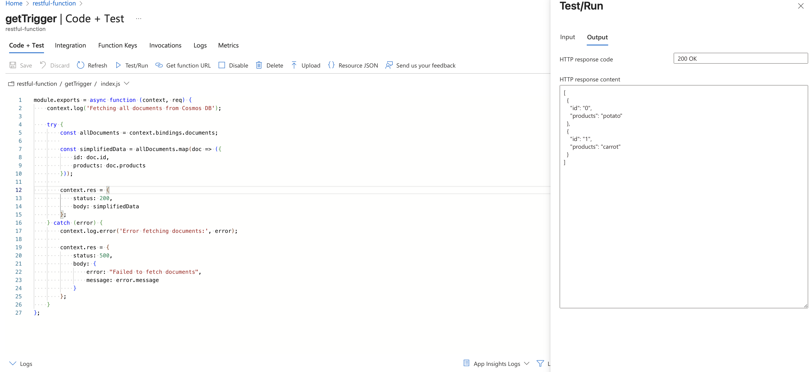

# CST8911 Midterm Project

## Group 2 members - Desmond Murphy, Dharti Patel, Fayz Reshid, Kylath Mamman George, Olivie Bergeron

## Chosen scenario - scenario 1

## Auth-Server documentation and source code

[Auth-Server Source Code](https://github.com/OlivBerg/auth-server),
[Auth-Server Documentation](https://github.com/OlivBerg/auth-server/blob/main/readme.md)

---

## Policy Error

- Created a low-cost Azure VM using the B1s size to keep costs down while still meeting project needs. Faced a policy restriction when trying to deploy in the US East region, so we switched to Canada Central for compatibility with the Azure for Students subscription.

## Creating a Function App

- Created an Azure Function App named restful-function using the Node.js 22 LTS runtime stack. 

## Creating GET and POST HTTP trigger functions

- Added HTTP trigger functions to handle GET and POST requests for the REST API.
This lets the Function App respond to incoming requests without needing a full server.

### getTrigger

- Created a new HTTP trigger function named getTrigger. This function allows users to send a GET request and receive data from the database.The authorization is kept at Function app for basic authentication while testing.

### postTrigger

- Created another HTTP tirgger functions named postTrigger. This function handles POST requests to add new data to the database. Used the same Function authorization level for consistency with the GET trigger. 

### Adding the cosmoDB primary connection string

- Added the Cosmos DB connection string to the Function App’s environment variables.
This allows the Function App to securely connect to the database without exposing credentials in code. 

### Where the cosmoDB primary connection String is located

- 
## Creating a Javascript function that fetches all data from the database

## Connecting the Trigger by adding function context into the function.json to fetch the database

## Creating a Javascript function that creates a new product in the database

## Connecting the Trigger by adding function context into the function.json to post data the database

## Created App Service Web app for the Auth Server

### In the Web app we connected our github account to setup a CI/CD pipeline for our Auth Server

### Environment variables for the Auth server

These variable were added:

- AZURE_GET_URL
- AZURE_POST_URL
- JWT_SECRET
- PORT

## Creating a VM to test our Authentication

## Creating a session with the Auth server hosted through a VM

## Sending a POST request to add a product to our db

## Retrieving products from our DB

